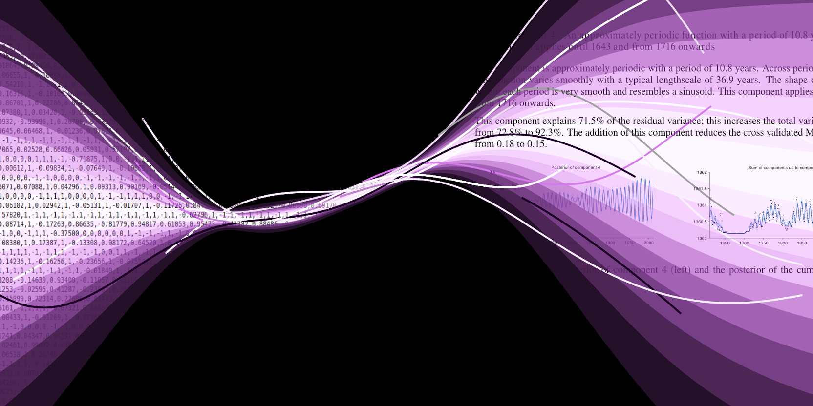

# JSC370 and JSC470: Data Science II and III
# Winter 2021

### Where and When
* Instructor: [David Duvenaud](http://www.cs.toronto.edu/~duvenaud)
* Teaching Assistant: [harsh Panchal](https://www.linkedin.com/in/harsh-panchal-618260151)
* Email: <duvenaud@cs.toronto.edu>, please put "JSC370" or "JSC470" in the title.
* Location: Zoom (see Quercus for details)
* Time: Tuesday and Thursdays, 3-5pm
* Office hours: Wednesdays 4-5 by zoom.
* Course Forum: [Discourse](https://bb-2021-01.teach.cs.toronto.edu/c/jsc370)
* [Course syllabus](syllabus.pdf)

## Course Structure

## Tentative Schedule
---
### Week 1: Background, motivation, course setup

January 12 Lecture:
[Video](https://play.library.utoronto.ca/9ac9b25727a49764c13ad038400c32f8) | [Slides](lectures/lec1.pdf)

  - [We don't need data scientists, we need data engineers](https://news.ycombinator.com/item?id=25775872)
  
  
January 12 Tutorial: Review of Python, Numpy, Pandas, Git, Colab
[Video](https://play.library.utoronto.ca/ff44be69e8e5f022da9f587e1ac457b5)

***
### Week 2 

January 19: Guest Lecture: [Ben Allison, Principal Machine Learning Scientist at Amazon](https://www.linkedin.com/in/ben-allison-2b881458/?originalSubdomain=uk) | [Video](https://play.library.utoronto.ca/e8aa287ea9fe2fbb90c6489077c4588f)

January 21: Lecture on Latent variable models and collaborative filtering, intro to Assignment 1
 - [Slides](lectures/lec2.pdf)
 - [Intro to JAX](https://colinraffel.com/blog/you-don-t-know-jax.html)
 - [Collaborative Filtering and the Missing at Random Assumption](https://arxiv.org/abs/1206.5267)
 - [If It’s Worth Doing, It’s Worth Doing With Made-Up Statistics](https://slatestarcodex.com/2013/05/02/if-its-worth-doing-its-worth-doing-with-made-up-statistics/)

***
### Week 3

January 25: Lecture 3: Confounding, censoring, and assignment 1 lab.

January 21: Assignment 1 presentations

***
### Week 4

Feb 1st: Assignment 1 due by midnight.

February 2nd: Guest Lecture: [Farah Bastien, Manager, Data Science/Data Engineer at MLSE (Maple Leaf Sports & Entertainment Partnership)](https://www.linkedin.com/in/farahbastien/?originalSubdomain=ca): Sports Analytics for the Leafs and the Raptors

February 4th: Assignment 2 lab 

***
### Week 5

February 9: Lecture 5: Goodhart's Law, Decision theory, + time series

 - [Blog post](https://towardsdatascience.com/unintended-consequences-and-goodharts-law-68d60a94705c)
 - [Machine Learning: The High Interest Credit Card of Technical Debt](https://research.google/pubs/pub43146/)

January 11: Assignment 2 presentations

***
### Week 6 

Feb 15: Assignment 2 due by midnight.

Reading Week

***
### Week 7

February 23: Guest Lecture: Wanying Zhao, Study design at Trilliam Foundation

February 25: Assignment 3 lab

***
### Week 8

March 2nd: Lecture 7: Outlier detection

February 4th: Assignment 3 presentations

***
### Week 9

March 8th: Assignment 3 due by midnight.

March 9: Natural Language processing

March 11: Assignment 4 lab

***
### Week 10

March 16: Lecture 9: Using large off-the-shelf models.

March 18: Assignment 4 presentations

***
### Week 11

March 22: Assignment 4 due by midnight.

March 23: Guest Lecture: Robert Grant, Cancer Genomics

March 25: Assignment 5 lab

***
### Week 12

March 30: Lecture 11: Reproducibility and version control for data

April 1: Assignment 5 presentations

***
### Week 13

April 5: Assignment 5 due by midnight.

April 6: Lecture 12: The future of Data Science

April 8: Paper presentations

